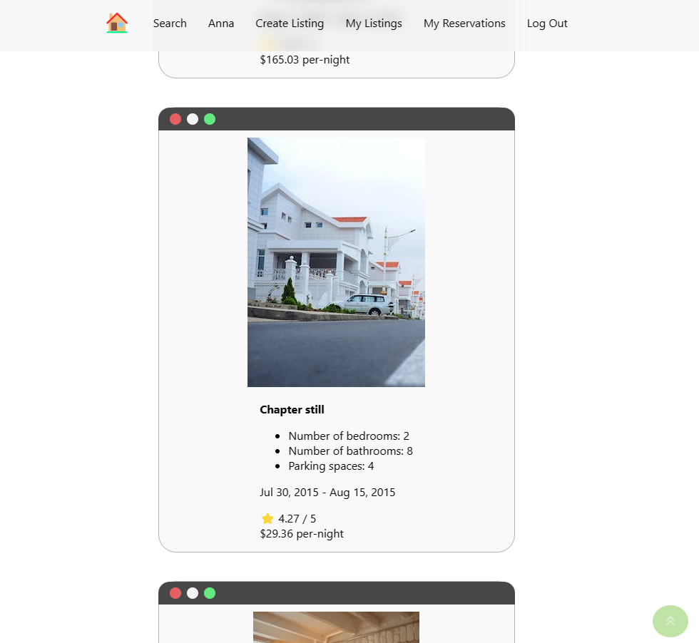
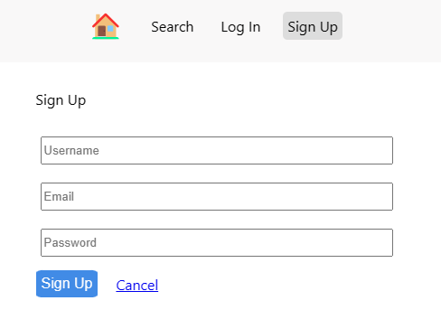

# LightBnB Project

A simple multi-page Airbnb clone that uses a server-side JavaScript to display the information from queries to web pages via SQL queries.

## Final Product
### Property Listings Page


### Search Page


### User Sign Up page


## Entity Relationship Diagram (ERD)
Below is the visual representation of the data model displaying the relationships between entities in the LightBnB database. 


## Project Structure
```
.
├── public
│   ├── javascript
│   │   ├── components 
│   │   │   ├── header.js
│   │   │   ├── login_form.js
│   │   │   ├── new_property_form.js
│   │   │   ├── property_listing.js
│   │   │   ├── property_listings.js
│   │   │   ├── search_form.js
│   │   │   └── signup_form.js
│   │   ├── libraries
│   │   ├── index.js
│   │   ├── network.js
│   │   └── views_manager.js
│   ├── styles
│   │   ├── main.css
│   │   └── main.css.map
│   └── index.html
├── server
│   ├── database.js
│   ├── db
│   │   └── index.js
│   ├── json
│   │   ├── properties.json
│   │   └── users.json
│   ├── routes
│   │   ├── apiRoutes.js
│   │   └── userRoutes.js
│   └── server.js
├── styles  
│   ├── _forms.scss
│   ├── _header.scss
│   ├── _property-listings.scss
│   └── main.scss
├── .gitignore
├── package-lock.json
├── package.json
├── README.md
```

  
* `public` contains all of the HTML, CSS, and client side JavaScript. 
  * `index.html` is the entry point to the application. It's the only html page because this is a single page application.
  * `javascript` contains all of the client side javascript files.
    * `index.js` starts up the application by rendering the listings.
    * `network.js` manages all ajax requests to the server.
    * `views_manager.js` manages which components appear on screen.
    * `components` contains all of the individual html components. They are all created using jQuery.
* `server` contains all of the server side JavaScript and a directory containing `.json` files.
  * `database.js` is responsible for all queries to the database
  * `db` contains all the database interaction code.
    * `json` is a directory that contains a bunch of dummy data in `.json` files.
  * `routes` contains the router files which are responsible for any HTTP requests to `/users/something` or `/api/something`. 
  * `server.js` is the entry point to the application. This connects the routes to the database.
* `styles` contains all of the sass files. 

## Dependencies

- bcrypt
- cookie-session
- express
- nodemon
- pg

## Setup Instructions

Clone this Repository locally.
## Database Setup
#### Starting PostgreSQL in WSL2

```
startpostgres
```
#### Starting PostgreSQL for Apple M1 owners
```
brew services start postgresql
```
### Connect to PostgreSQL
```
psql
```
### Create and connect to the database locally
```
CREATE DATABASE lightbnb;
\c lightbnb
```

### Create and populate the database tables
```
\i migrations/01_schema.sql
\i seeds/01_seeds.sql
\i seeds/02_seeds.sql
```

## Connect to web application

1. Navigate to the root LightBnB_WebApp and install dependencies
```npm install```
2. Run the application
```npm run local```
3. Open the web app via http://localhost:3000 on the browser
